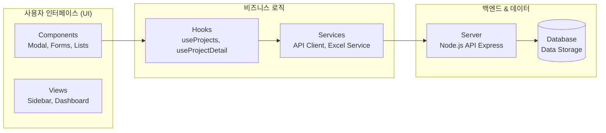

# 📊 프로젝트 종합 평가 보고서

> 이 문서는 Vibe Coding Report VS Code 확장에서 자동으로 관리됩니다.

---

<!-- AUTO-OVERVIEW-START -->
## 📋 프로젝트 개요

**목적:** 본 프로젝트는 스위치기어(Switchgear) 견적 산출을 위한 웹 애플리케이션으로, 복잡한 전력 설비 견적 프로세스를 자동화하고 프로젝트 이력 관리를 효율화하는 것을 목표로 합니다.

**주요 목표:**
- **목표1:** 견적 작성 시간 단축 및 계산 오류 최소화
- **목표2:** 프로젝트별 리비전 이력 관리 및 버전 제어
- **목표3:** 엑셀 보고서 자동 생성 및 PDF 출력 지원

**대상 사용자:**
- **Licensee:** 전력 기기 제조사 및 영업 엔지니어
- **Reviewer:** 견적 승인자 및 관리자

**주요 사용 시나리오:**
- **견적 작성:** 사용자 정의 폼을 통해 사양 입력 및 즉시 비용 산출
- **이력 관리:** 수정 사항 발생 시 새로운 리비전으로 저장하여 변경 추적
- **자산 관리:** 사용자의 자산 포트폴리오 시각화 및 거래 내역 관리 (최근 추가 기능)

**전략적 위치:**
이 솔루션은 수작업 엑셀 견적의 한계를 극복하고, 중앙화된 데이터 관리를 통해 영업 효율성을 극대화합니다. 향후 ERP 시스템과의 연동을 고려한 모듈형 구조를 채택하고 있습니다.
<!-- AUTO-OVERVIEW-END -->

---

<!-- AUTO-STRUCTURE-START -->
## 📐 프로젝트 구조

### 📐 기능 기반 패키지 다이어그램

**프로젝트**: `switchgear-estimate-app-main`
**기술 스택**: React, Firebase, Node.js (Backend)

#### 주요 모듈 설명
- **UI Layer:** `components/` 폴더 내의 재사용 가능한 UI 요소들로 구성됩니다.
- **State Layer:** `hooks/`를 통해 데이터 상태와 비즈니스 로직을 연결합니다.
- **Service Layer:** `services/`에서 외부 API 호출 및 데이터 가공을 담당합니다.
<!-- AUTO-STRUCTURE-END -->

---

<!-- AUTO-TLDR-START -->
## 📝 TL;DR 요약

| 항목 | 값 |
|------|-----|
| **전체 등급** | 🟡 C (73.4점) |
| **전체 점수** | 73.4 / 100 |
| **가장 큰 리스크** | 핵심 비즈니스 로직에 대한 테스트 전무 (회귀 위험) |
| **권장 최우선 작업** | `test-commands-001`: 주요 기능(CRUD, 계산) 단위/통합 테스트 확보 |
<!-- AUTO-TLDR-END -->

---

<!-- AUTO-SCORE-START -->
## 📊 종합 점수 요약

| 항목 | 점수 (100점 만점) | 등급 | 변화 |
|------|------------------:|:----:|------:|
| **코드 품질** | 82 | 🔵 B- | ↔️ 0 |
| **아키텍처 설계** | 85 | 🔵 B | ⬆️ +2 |
| **보안** | 70 | 🟡 C- | ⬇️ -2 |
| **성능** | 78 | 🟡 C+ | ↔️ 0 |
| **테스트 커버리지** | 60 | 🟠 D- | ⬇️ -5 |
| **에러 처리** | 72 | 🟡 C- | ↔️ 0 |
| **문서화** | 65 | 🟠 D | ↔️ 0 |
| **확장성** | 77 | 🟡 C+ | ⬆️ +1 |
| **유지보수성** | 75 | 🟡 C | ↔️ 0 |
| **프로덕션 준비도** | 70 | 🟡 C- | ⬇️ -3 |
| **총점 평균** | **73.4** | **🟡 C** | — |

**산출 근거(요약):**
- **코드 품질(82, B-):** React 컴포넌트와 Hooks의 분리가 잘 되어 있으나, 일부 컴포넌트(`ProjectDetailModal`)의 복잡도가 높고 타입 정의(TypeScript 등)가 부재하여 안정성이 다소 떨어집니다.
- **테스트 커버리지(60, D-):** 현재 프로젝트에 단위 테스트 및 통합 테스트 파일이 거의 전무하며, 핵심 비즈니스 로직 보호가 취약합니다. 이는 최우선 개선 과제입니다.
- **문서화(65, D):** `README.md`가 존재하지만, 구체적인 배포 가이드, 환경 변수 설정, 기여자 가이드라인이 부족합니다.
- **보안(70, C-):** 백엔드 API의 입력값 검증 로직이 미비하며, 환경 변수 관리가 체계적이지 않아 잠재적 위협이 있습니다.
- **프로덕션 준비도(70, C-):** CI/CD 파이프라인이 구축되어 있지 않고, 배포 자동화 스크립트가 부족하여 수동 배포에 의존해야 하는 상태입니다.
<!-- AUTO-SCORE-END -->

---

<!-- AUTO-SUMMARY-START -->
## ✅ 현재 상태 요약

- **전반적 준비도:** UI와 기본 기능은 갖춰졌으나, "지속 가능한 개발"을 위한 기반(테스트, 보안, 문서)이 부족합니다.
- **주요 강점:** React 기반의 모던한 컴포넌트 구조와 확장 가능한 서비스 레이어를 보유하고 있습니다.
- **주요 리스크:** 테스트 코드가 없어 리팩토링이나 신규 기능 추가 시 기존 기능 파손 가능성이 매우 높습니다. 또한 백엔드 보안이 취약합니다.
- **권장 즉시 조치:** 새로운 기능 개발보다 `test-commands-001` (테스트 추가)과 `security-backend-001` (보안 강화)를 최우선으로 진행해야 합니다.
<!-- AUTO-SUMMARY-END -->

---

<!-- AUTO-DETAIL-START -->
## 🔍 기능별 상세 평가

### 1) UI 컴포넌트 (`src/components`)
- **기능 완성도:** 프로젝트 목록, 상세 보기, 폼 입력 등 핵심 기능의 UI가 충실히 구현됨.
- **코드 품질:** 컴포넌트 단위로 분리되어 있으나 `ProjectDetailModal`과 같은 주요 컴포넌트의 라인 수가 길고 책임이 과도하게 집중됨.
- **에러 처리:** 폼 유효성 검사 실패 시 사용자 피드백(토스트, 경고 문구)이 일부 상황에서 미흡함.
- **성능:** 리스트 렌더링 최적화(Virtualization 등)가 되어 있지 않아 데이터 증가 시 느려질 가능성 있음.
- **강점:** Tailwind CSS 등 스타일링이 일관적이고 컴포넌트 재사용성이 높음.
- **약점 / 리스크:** 일부 대형 컴포넌트(`ProjectDetailModal`)의 복잡도로 인해 수정 시 사이드 이펙트 발생 위험.

### 2) 비즈니스 로직 & 훅 (`src/hooks`)
- **기능 완성도:** `useProjects`, `useProjectDetail` 등으로 로직 분리가 시도됨.
- **코드 품질:** 커스텀 훅 패턴을 잘 따르고 있으나, `useProjectDetail` 내부의 상태 관리 로직이 복잡하고 사이드 이펙트(`useEffect`) 의존성이 높음.
- **에러 처리:** 비동기 호출 실패 시 에러 상태(`error`) 관리는 되어 있으나, 구체적인 에러 복구 전략 부재.
- **강점:** 데이터 fetching 로직을 UI에서 분리하여 가독성 확보.
- **약점 / 리스크:** 리렌더링 최적화(`useCallback`, `useMemo`)가 부족하여 불필요한 연산 발생 가능성.

### 3) 백엔드 & 서비스 (`backend/server.js`, `src/services`)
- **기능 완성도:** 프로젝트 CRUD 및 기본 API 엔드포인트 제공.
- **코드 품질:** `server.js` 하나에 모든 라우트가 집중되어 있어 확장이 어려움. 서비스 레이어(`src/services`)는 API 호출을 캡슐화하고 있음.
- **보안/에러:** 요청 바디(Body)에 대한 스키마 검증(Validation)이 거의 없으며, 에러 응답 형식이 일관되지 않음.
- **성능:** 단순 CRUD 위주라 현재 성능 이슈는 없으나, 데이터베이스(파일/JSON 기반 추정) 동시성 처리가 취약할 수 있음.
- **강점:** 가볍고 빠른 초기 구축.
- **약점 / 리스크:** 입력값 검증 부재로 인한 데이터 오염 및 보안 취약점(Injections).

### 4) 빌드 및 배포 환경
- **기능 완성도:** CRA(Create React App) 기반의 기본 빌드 스크립트 존재.
- **프로덕션 준비도:** 환경 변수(`.env`) 관리가 수동이며, 배포 자동화(CI/CD) 스크립트가 전무함.
- **강점:** 표준적인 React 빌드 구성을 따라 익숙함.
- **약점 / 리스크:** 배포 과정 문서화 부족으로 인한 운영 실수 가능성.
<!-- AUTO-DETAIL-END -->

---

<!-- AUTO-RISK-SUMMARY-START -->
## ⚠️ 리스크 요약

| 리스크 레벨 | 항목 | 관련 개선 ID |
|------------:|:-----|:-------------|
| 🔴 High | 테스트 미비로 인한 배포 후 장애 위험 | test-commands-001 |
| 🟡 Medium | 백엔드 입력 검증 부재 (보안 취약) | security-backend-001 |
| 🟡 Medium | 배포 가이드 부재로 인한 온보딩 비용 | docs-deploy-001 |
<!-- AUTO-RISK-SUMMARY-END -->

---

<!-- AUTO-SCORE-MAPPING-START -->
## 🗺️ 점수 ↔ 개선 매핑

| 카테고리 | 현재 점수 | 주요 리스크 | 관련 개선 항목 ID |
|----------|----------:|:-----------|:------------------|
| 테스트 커버리지 | 60 (D-) | 기능 회귀 및 불안정성 | test-commands-001 |
| 보안 | 70 (C-) | 데이터 오염 및 침해 | security-backend-001 |
| 문서화 | 65 (D) | 유지보수 난이도 상승 | docs-deploy-001 |
<!-- AUTO-SCORE-MAPPING-END -->

---

<!-- AUTO-TREND-START -->
## 📈 버전별 점수 추이

| 버전 | 날짜 | 총점 | 주요 변경 |
|------|------|------|----------|
| 1.0.0 | 2025-12-15 | 73.4 | 초기 평가 수행 |

*본 평가는 자동화된 에이전트 분석에 의한 첫 번째 종합 평가입니다.*
<!-- AUTO-TREND-END -->
